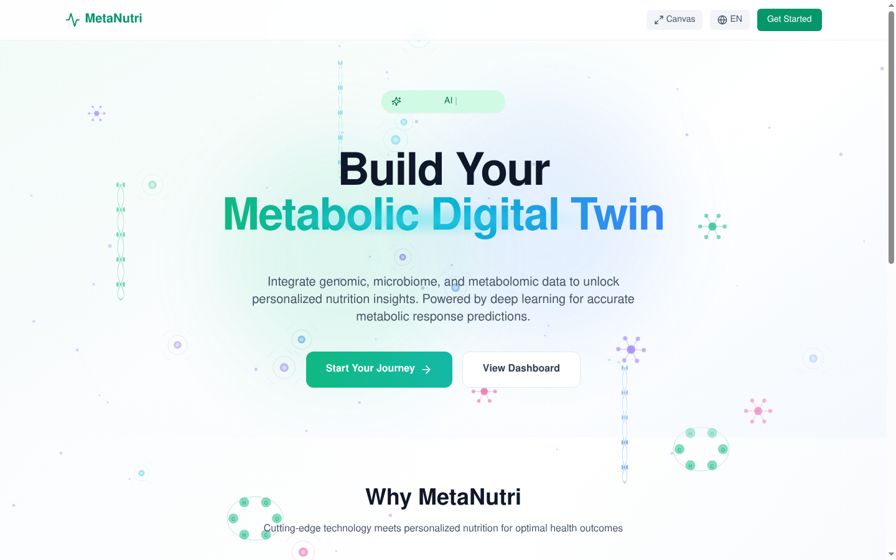
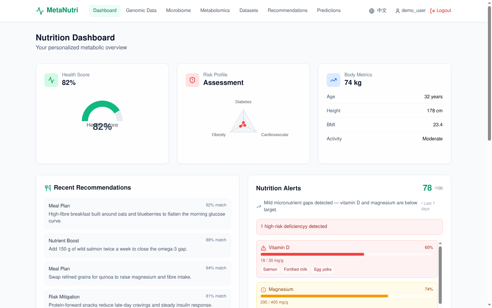
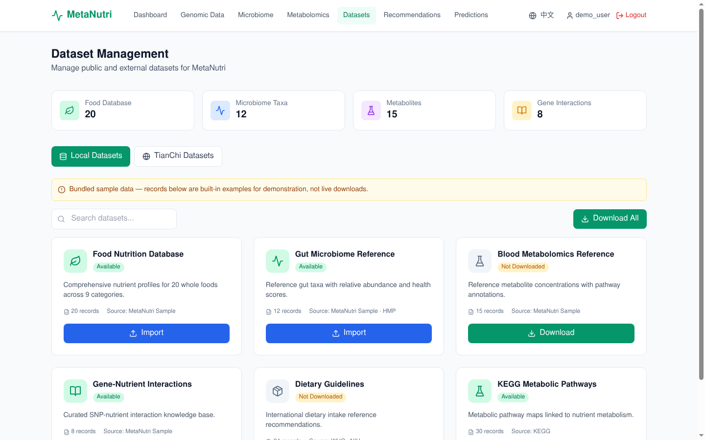
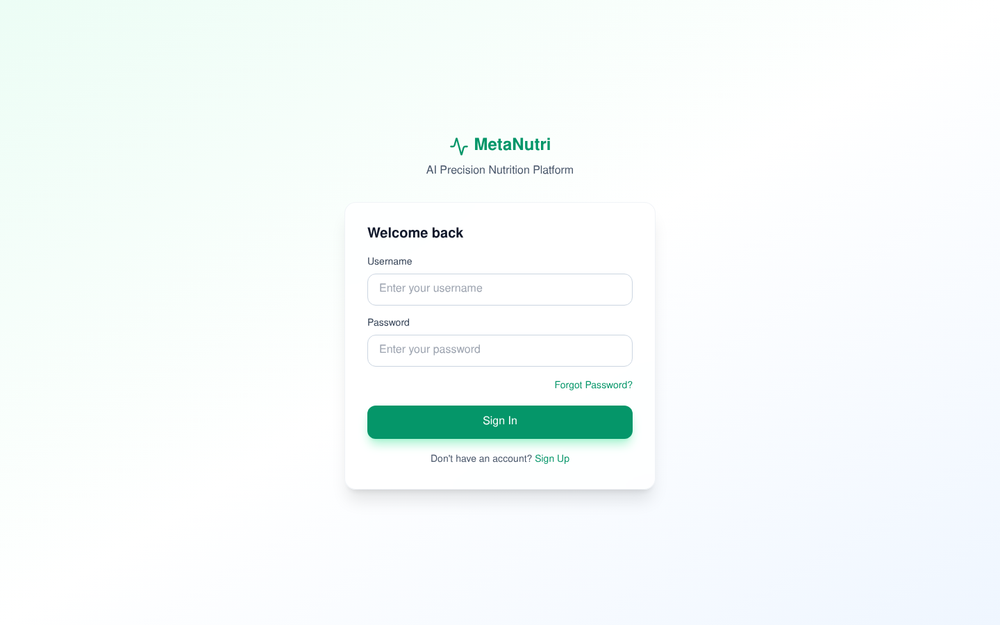

<div align="center">

<p align="right">
  <strong>English</strong> | <a href="README.zh-CN.md">简体中文</a>
</p>


# 🧬 MetaNutri

**AI-Powered Precision Nutrition Metabolic Digital Twin Platform**

[](https://github.com/ElijahZhao/MetaNutri---AI-/stargazers)
[](https://github.com/ElijahZhao/MetaNutri---AI-/network/members)
[](LICENSE)
[](https://github.com/ElijahZhao/MetaNutri---AI-/actions/workflows/ci.yml)
[](https://github.com/ElijahZhao/MetaNutri---AI-/issues)
[](CONTRIBUTING.md)

[](https://nextjs.org/)
[](https://fastapi.tiangolo.com/)
[](https://www.python.org/)
[](https://supabase.com/)
[](https://pytorch.org/)

**[🌐 Platform Live Demo](https://meta-nutri-ai.vercel.app/) · [🧪 PPGR Research Demo (real AI)](https://metanutri-ai-ppgr-predictor.streamlit.app/) · [📖 Documentation](docs/) · [🐛 Report Bug](https://github.com/ElijahZhao/MetaNutri---AI-/issues) · [✨ Request Feature](https://github.com/ElijahZhao/MetaNutri---AI-/issues)**

[](https://meta-nutri-ai.vercel.app/)
[](https://metanutri-backend.onrender.com/)
[](https://supabase.com/)

</div>

---

## 📑 Table of Contents

- [About the Project](#-about-the-project)
- [📌 Project Status](#-project-status)
- [🧩 Related Repositories](#-related-repositories)
- [📸 Screenshots](#-screenshots)
- [✨ Key Features](#-key-features)
- [🏗️ Architecture](#️-architecture)
- [🛠️ Tech Stack](#️-tech-stack)
- [🚀 Getting Started](#-getting-started)
- [🔌 API & AI/ML](#-api--aiml)
- [🧪 Testing & CI](#-testing--ci)
- [☁️ Cloud Deployment](#️-cloud-deployment)
- [📁 Project Structure](#-project-structure)
- [⚠️ Limitations & Scope](#️-limitations--scope)
- [🤝 Contributing](#-contributing)
- [📄 License](#-license)
- [📮 Contact](#-contact)

---

## 🌟 About the Project

**MetaNutri** is an AI-powered precision nutrition metabolic digital twin platform that integrates **genomics**, **microbiome**, and **metabolomics** data to deliver personalized nutritional recommendations and health management solutions.

This repository is primarily a **full-stack engineering project**: a production-style Next.js frontend, a FastAPI backend and a managed PostgreSQL database, wired end to end and deployed to Vercel / Render / Supabase. The live API serves **transparent, deterministic rule-based analytics**; the PyTorch model code under `backend/app/ml/` is research scaffolding and is **not wired into the live API**. Real, data-trained models are developed in a separate research module.

### 📌 Project Status

> **This repository is an engineering demo with a separate research track.**
>
> - **What runs live:** authentication, database CRUD, food search, import/export — plus **deterministic, rule-based heuristics** for glucose and nutrient estimates. A few endpoints additionally use random values and are illustrative only.
> - **Research scaffolding (not live):** the PyTorch model code in `backend/app/ml/` is **not trained on real data** and is **never loaded at runtime**.
> - **Where the real AI is:** a self-contained research module — postprandial glucose-response prediction on **real open data**, with rigorous subject-wise evaluation — developed and deployed **independently** of this platform. See [docs/ROADMAP.md](docs/ROADMAP.md).
> - **Not a medical device.** Nothing here is medical advice; never use it to make clinical decisions.

### 🎯 Why MetaNutri?

| Problem | Solution |
|---------|----------|
| 🍎 Generic diet advice ignores individual biology | Personalized recommendations based on YOUR omics profile |
| 🧬 Genomics data is hard to interpret | AI translates complex data into actionable insights |
| 📊 Scattered health data across apps | Unified dashboard for genomics, microbiome, metabolomics |
| 🤖 "Black box" AI recommendations | Transparent rule-based scoring shows *which* factors drive each suggestion |
| ⚠️ Reactive healthcare | Early nutritional deficiency detection and risk alerts |

---

## 🧩 Related Repositories

This project spans **two independent GitHub repositories**. They are deliberately **not** linked by git — no submodule, no subtree, no `.gitmodules`. The coupling is by **provenance**, not by tooling.

| | **This repository** | **[`ppgr-predictor`](https://github.com/ElijahZhao/ppgr-predictor)** |
|---|---|---|
| **What it is** | The whole project: the full-stack platform (`backend/`, `frontend/`) **and** the research module (`research/`) | The **deployment** of the research module's demo — a self-contained Streamlit app |
| **Live** | <https://meta-nutri-ai.vercel.app> | <https://metanutri-ai-ppgr-predictor.streamlit.app> |
| **Size** | ~17 MB | ~690 KB |
| **Role** | Source of truth | Curated, read-only copy |

**Flow is one way: this repository → `ppgr-predictor`.** Nothing flows back. The demo repo holds a *curated subset* — `app.py`, `inference.py`, `model/*.json`, `assets/`, `src/`, `reports/`, `experiments/` — and imports nothing from the platform.

**The rule that keeps them consistent.** `research/` here is the source of truth. Every number in the demo repo (and in its README) is generated from `research/experiments/*.csv` and must match the [technical report](research/reports/technical_report.md). The demo repo is **never edited independently**; if the two ever disagree, this repository wins and the demo is regenerated.

**Why not link them as a submodule.** Streamlit Community Cloud builds the **repository root** of whichever repo you point it at and expects `app.py` + `requirements.txt` there. Pointing it at this repository would mean either dragging the whole platform into that build, or relying on a subdirectory entrypoint the free tier does not let you choose. A submodule would add a second checkout step and a new failure mode to that build without removing the need for the curated subset anyway. Different consumers, different runtimes, different size budgets — two repositories is the correct design.

**Do they interact at runtime? No.** There is no API call, no shared package and no data exchange between them. The demo is standalone: it loads exported JSON boosters and predicts locally.

> `ppgr-predictor` is kept working locally at `.deploy/ppgr-predictor/` as an **untracked** mirror (see `.gitignore`). That mirror is a convenience for pushing; it is not part of this repository.

---

## 📸 Screenshots

| Landing page | Dashboard |
|:---:|:---:|
|  |  |

| Dataset management | Sign in |
|:---:|:---:|
|  |  |

---

## ✨ Key Features

<div align="center">

| | Feature | Description |
|---|---------|-------------|
| 🧬 | **Tri-Omics Integration** | Genomics + Microbiome + Metabolomics data analysis in a unified pipeline |
| 🤖 | **Metabolic Analytics** | Deterministic, rule-based glucose and nutrient estimates — transparent by construction. PyTorch model code is research scaffolding and is not wired into the live API |
| 🔍 | **Transparent Scoring** | Every recommendation exposes its contributing factors (heuristic contribution weights, not SHAP) |
| 📊 | **Interactive Dashboards** | Health score, body-metrics and risk-radar cards backed by ECharts visualizations |
| 🚨 | **Health Alerts** | Real-time nutritional deficiency detection and health risk assessment |
| 🍎 | **Food & Nutrition Explorer** | Searchable food database with per-user food scoring |
| 🍽️ | **AI Meal Planning** | AI-generated personalized meal plans based on your biology |
| 📁 | **Dataset Browser** | Explore the curated reference datasets shipped with the platform |
| 📥 | **Import / Export** | Bring your own omics and food data in, and take your results out |
| 🔐 | **Secure by Default** | httpOnly-cookie sessions, bcrypt hashing and request rate limiting |
| 🌐 | **Bilingual UI** | Full English / Chinese interface on a lightweight custom i18n layer |
| 📱 | **Polished & Responsive** | DNA / particle animations and layouts that adapt to desktop, tablet and mobile |

</div>

---

## 🏗️ Architecture

```
┌─────────────────────────────────────────────────────────────────────┐
│                       Users (Browser / Mobile)                      │
└──────────────────────────────────┬──────────────────────────────────┘
                                   │  HTTPS
                                   ▼
┌─────────────────────────────────────────────────────────────────────┐
│                        Vercel (Frontend)                            │
│    Next.js 16 App Router — statically prerendered pages             │
│  ┌───────────────┐┌────────────────┐┌───────────────────────────┐   │
│  │ Static Pages  ││ Edge Middleware││ ECharts + custom i18n      │   │
│  │ (App Router)  ││  (proxy.ts)    ││ (charts, EN / ZH)          │   │
│  └───────────────┘└────────────────┘└───────────────────────────┘   │
│    rewrites  /api/*  →  same-origin proxy (keeps cookies 1st-party) │
└──────────────────────────────────┬──────────────────────────────────┘
                                   │  HTTPS / REST
                                   ▼
┌─────────────────────────────────────────────────────────────────────┐
│                         Render (Backend)                            │
│                       FastAPI (Python 3.11)                         │
│  ┌────────┐┌────────┐┌────────┐┌────────┐┌──────────┐              │
│  │  Auth  ││ Users  ││ Foods  ││ Omics  ││ Predict  │              │
│  └────────┘└────────┘└────────┘└────────┘└──────────┘              │
│  ┌────────┐┌──────────┐┌────────┐┌──────────────┐                  │
│  │ Alerts ││ Datasets ││ Import ││ Analytics    │                  │
│  └────────┘└──────────┘└────────┘└──────────────┘                  │
│   SQLAlchemy 2.0 async ORM · rule-based · optional Redis cache      │
└──────────────────────────────────┬──────────────────────────────────┘
                                   │
                                   ▼
┌─────────────────────────────────────────────────────────────────────┐
│                   Supabase (Managed PostgreSQL)                     │
│   Stores user, profile, food, omics and dataset tables.             │
│   Auth is handled by the FastAPI API via httpOnly cookies;          │
│   Supabase Auth and Storage are NOT used.                           │
└─────────────────────────────────────────────────────────────────────┘
```

---

## 🛠️ Tech Stack

### 🎨 Frontend

| Technology | Version | Purpose |
|------------|---------|---------|
| [Next.js](https://nextjs.org/) | 16 | React framework with SSR & SEO |
| [React](https://react.dev/) | 19 | UI component library |
| [TypeScript](https://www.typescriptlang.org/) | 5 | Type safety |
| [Tailwind CSS](https://tailwindcss.com/) | 3 | Utility-first CSS |
| [ECharts](https://echarts.apache.org/) | 6 | Data visualization |
| [TanStack Query](https://tanstack.com/query) | 5 | Server state & caching |
| [Zustand](https://zustand-demo.pmnd.rs/) | 5 | Client state management |
| [React Hook Form](https://react-hook-form.com/) | 7 | Form validation |
| [Zod](https://zod.dev/) | 4 | Schema validation |
| Custom i18n | - | Lightweight EN/ZH translations (`src/lib/i18n.tsx`; no i18next dependency) |

### ⚙️ Backend

| Technology | Version | Purpose |
|------------|---------|---------|
| [FastAPI](https://fastapi.tiangolo.com/) | 0.115 | High-performance async API |
| [Python](https://www.python.org/) | 3.11 | Runtime |
| [SQLAlchemy](https://www.sqlalchemy.org/) | 2.0 | Async ORM |
| [PostgreSQL](https://www.postgresql.org/) | - | Primary database |
| [Redis](https://redis.io/) | 5 | Caching & rate limiting (optional, in-memory fallback) |
| [Pydantic](https://docs.pydantic.dev/) | 2 | Data validation |
| [python-jose](https://github.com/mpdavis/python-jose) | 3.5 | JWT (issued into httpOnly cookies) |
| [Passlib](https://passlib.readthedocs.io/) | 1.7 | Password hashing (bcrypt) |

### 🧠 AI / ML

| Technology | Version | Purpose |
|------------|---------|---------|
| [PyTorch](https://pytorch.org/) | 2.x | Research scaffolding for model prototypes (not loaded by the live API) |
| [scipy](https://scipy.org/) | 1.14 | Scientific / statistical computing |
| [SHAP](https://shap.readthedocs.io/) | 0.46 | Declared for the research track; the live API does not run SHAP |
| [NumPy](https://numpy.org/) | 1.26 | Numerical computing |
| [Pandas](https://pandas.pydata.org/) | 2.2 | Data processing |
| [scikit-learn](https://scikit-learn.org/) | 1.5 | Feature scaling & baseline models (research scaffolding) |
| [requests](https://docs.python-requests.org/) | 2.32 | HTTP client (bundled reference data is generated locally, not downloaded) |

---

## 🚀 Getting Started

### Prerequisites

- **Python** ≥ 3.11
- **Node.js** ≥ 20.19
- **npm** ≥ 9 or **pnpm** ≥ 8
- **PostgreSQL** ≥ 14 (or use [Supabase](https://supabase.com/) for cloud)

### 📦 Installation

```bash
# 1. Clone the repository
git clone https://github.com/ElijahZhao/MetaNutri---AI-.git
cd MetaNutri---AI-

# 2. Set up backend
cd backend
cp .env.example .env          # Edit with your credentials
pip install -r requirements.txt
cd ..

# 3. Set up frontend
cd frontend
cp .env.example .env.local     # Edit with your API URL
npm install
cd ..

# 4. Start services (use separate terminals)
cd backend && uvicorn app.main:app --reload --host 0.0.0.0 --port 8000
cd frontend && npm run dev
```

### 🌐 Access Points

| Service | URL | Description |
|---------|-----|-------------|
| Frontend | http://localhost:3000 | Next.js web app |
| Backend API | http://localhost:8000 | FastAPI server |
| API Docs (Swagger) | http://localhost:8000/docs | Interactive API documentation |
| API Docs (ReDoc) | http://localhost:8000/redoc | Alternative API docs |

### 🐳 Docker (Alternative)

```bash
# Start everything with one command
docker-compose up -d

# View logs
docker-compose logs -f

# Stop services
docker-compose down
```

---

## 🔌 API & AI/ML

The full endpoint list lives in the [📘 API Reference](docs/API.md). The backend also exposes interactive docs at `<BASE>/docs` (Swagger) and `<BASE>/redoc`.

### Authentication (httpOnly cookies)

Tokens are delivered as httpOnly cookies at login; the frontend never has to attach an `Authorization` header manually:

```http
POST /api/auth/login          # {username, password}
Set-Cookie: metanutri_access=...; HttpOnly; SameSite=Lax
Set-Cookie: metanutri_refresh=...; HttpOnly; SameSite=Lax
```

### A complete AI call path

1. **Log in** to obtain a session — later requests carry the cookie automatically.
2. **Upload omics data**: `POST /api/genomic/upload`, `/api/microbiome/upload`, `/api/metabolomics/upload`.
3. **Run predictions**: `POST /api/predict/glucose-response` or `GET /api/predict/risk-assessment`.
4. **Get recommendations / meal plans**: `POST /api/recommendations/meal-plan`.
5. **Read the explanation**: prediction responses include a nutritional interpretation and `feature_contributions` — heuristic contribution weights, **not** SHAP values.

```bash
BASE=https://metanutri-backend.onrender.com

# Log in and persist the cookies
curl -c cookies.txt -X POST "$BASE/api/auth/login" \
  -H 'Content-Type: application/json' \
  -d '{"username":"you","password":"secret123"}'

# Generate a meal plan (auth required)
curl -b cookies.txt -X POST "$BASE/api/recommendations/meal-plan" \
  -H 'Content-Type: application/json' \
  -d '{"calorie_target":2000}'
```

### AI/ML modules (backend)

| Module | Capability |
|--------|------------|
| `ml/metabolic_response_model.py` | Research prototype: glucose response / nutrient absorption predictor (not wired to the live API) |
| `ml/gene_nutrition_model.py` | Research prototype: gene–nutrition association (GNN) |
| `ml/microbiome_vae.py` | Research prototype: microbiome health (VAE) |
| `ml/explainability.py` | Research prototype: SHAP / LIME wrappers (the live API returns heuristic contribution weights instead) |
| `ml/train_models.py` | Prototype training scripts (train on synthetic tensors) |
| `ml/weights/` | Weights trained on synthetic data; never loaded at runtime |

---

## 🧪 Testing & CI

| Check | Tooling | Command |
|-------|---------|---------|
| Type safety | TypeScript (`tsc --noEmit`) | `npm run typecheck` |
| Lint | ESLint (flat config) | `npm run lint` |
| Unit / component tests | Vitest + Testing Library | `npm test` |
| End-to-end tests | Playwright (Chromium) | `npm run test:e2e` |
| Backend syntax + import smoke test | `compileall` + FastAPI import | `python -m compileall -q app` |

Every push and pull request runs all of the above through [`.github/workflows/ci.yml`](.github/workflows/ci.yml).

---

## ☁️ Cloud Deployment

MetaNutri is designed for seamless cloud deployment with the following stack:

| Component | Platform | Guide |
|-----------|----------|-------|
| 🗄️ Database | [Supabase](https://supabase.com/) | Managed PostgreSQL |
| ⚙️ Backend API | [Render](https://render.com/) | Python deployment from GitHub |
| 🎨 Frontend Web | [Vercel](https://vercel.com/) | Next.js native platform |

### Step 1: Supabase (Database)

1. Create a project at [supabase.com](https://supabase.com/)
2. Go to **SQL Editor** → New query
3. Run the SQL from [`backend/schema.sql`](backend/schema.sql)
4. Copy your connection string from **Settings → Database → Connection string (URI)**

### Step 2: Render (Backend)

1. Create a new **Web Service** at [render.com](https://render.com/) → **Build & Deploy from a Repository** → select your repo
2. In **Settings → Docker**, set the **Dockerfile Path** to `backend/Dockerfile`
3. In **Environment**, add:
   - `DATABASE_URL` = your Supabase **connection pooler** URI (port **5432 session mode** — Render has no IPv6, so use `*.pooler.supabase.com`, not the IPv6-only direct host)
   - `SECRET_KEY` = a secure random string
4. Deploy → copy your `https://your-service.onrender.com` domain

### Step 3: Vercel (Frontend)

1. Import project from GitHub → select your repo
2. **Root Directory**: `frontend`
3. **Framework Preset**: Next.js (auto-detected)
4. **Environment Variables**:
   - `NEXT_PUBLIC_API_URL` = your Render backend URL (e.g. `https://your-service.onrender.com`)
5. Click **Deploy**

---

## 📁 Project Structure

```
MetaNutri---AI-/
├── backend/                          # ⚙️ FastAPI backend
│   ├── app/
│   │   ├── api/                      # API route handlers
│   │   │   ├── auth.py               # Authentication (register / login / refresh)
│   │   │   ├── users.py              # User profile management
│   │   │   ├── food.py               # Food search, logging & nutrition
│   │   │   ├── genomic.py            # Genomics data analysis
│   │   │   ├── microbiome.py         # Microbiome analysis
│   │   │   ├── metabolomics.py       # Metabolomics data
│   │   │   ├── predict.py            # AI prediction endpoints
│   │   │   ├── recommendation.py     # Nutrition recommendations & meal plans
│   │   │   ├── datasets.py           # Dataset management
│   │   │   ├── import_export.py      # Data import / export
│   │   │   └── nutrition_alerts.py   # Health alert system
│   │   ├── core/                     # Core infrastructure
│   │   │   ├── config.py             # Settings & env vars
│   │   │   ├── security.py           # JWT + httpOnly cookie auth, password hashing
│   │   │   ├── rate_limit.py         # In-memory rate limiter
│   │   │   └── redis.py              # Redis cache (graceful fallback)
│   │   ├── db/
│   │   │   └── session.py            # SQLAlchemy async engine
│   │   ├── ml/                       # 🧠 Machine learning models
│   │   │   ├── metabolic_response_model.py   # Research prototype (not wired to live API)
│   │   │   ├── gene_nutrition_model.py       # Research prototype (GNN)
│   │   │   ├── microbiome_vae.py             # Research prototype (VAE)
│   │   │   ├── explainability.py             # Research prototype explainers
│   │   │   ├── dataset_downloader.py         # Generates bundled sample data (no network fetch)
│   │   │   ├── train_models.py               # Prototype training scripts (synthetic data)
│   │   │   └── weights/                      # Weights trained on synthetic data (unused at runtime)
│   │   ├── models/                   # SQLAlchemy ORM models
│   │   ├── schemas/                  # Pydantic request / response schemas
│   │   ├── services/                 # Business logic (seed data, import / export)
│   │   └── main.py                   # FastAPI application entry
│   ├── data/                         # Seed & reference datasets (JSON)
│   ├── schema.sql                    # PostgreSQL table definitions
│   ├── requirements.txt              # Python dependencies
│   ├── Dockerfile                    # Production container
│   └── .env.example                  # Environment template
│
├── frontend/                         # 🎨 Next.js frontend
│   ├── src/
│   │   ├── app/                      # Next.js App Router
│   │   │   ├── (auth)/               # Public auth group
│   │   │   │   ├── login/            # Sign in
│   │   │   │   └── forgot-password/  # Password recovery
│   │   │   ├── (app)/                # Protected group (auth guarded)
│   │   │   │   ├── dashboard/        # Analytics & health score
│   │   │   │   ├── profile/          # User profile
│   │   │   │   ├── genomic/          # Genomics analysis
│   │   │   │   ├── microbiome/       # Microbiome analysis
│   │   │   │   ├── metabolomics/     # Metabolomics data
│   │   │   │   ├── predict/          # AI prediction tools
│   │   │   │   ├── recommendations/  # Personalized advice
│   │   │   │   ├── meal-plan/        # AI meal planner
│   │   │   │   ├── explore/          # Food exploration
│   │   │   │   └── datasets/         # Dataset browser
│   │   │   ├── page.tsx              # Landing page
│   │   │   ├── content.tsx           # Landing page content
│   │   │   ├── layout.tsx            # Root layout (metadata, i18n)
│   │   │   ├── loading.tsx           # Route loading UI
│   │   │   ├── error.tsx             # Global error boundary
│   │   │   ├── not-found.tsx         # Custom 404 page
│   │   │   ├── icon.svg              # Favicon
│   │   │   ├── opengraph-image.tsx   # Dynamic Open Graph image
│   │   │   ├── twitter-image.tsx     # Dynamic Twitter card
│   │   │   ├── robots.ts             # robots.txt
│   │   │   └── sitemap.ts            # sitemap.xml
│   │   ├── components/               # Reusable UI components
│   │   │   ├── home/                 # Landing sections (hero, features, CTA)
│   │   │   ├── dashboard/            # Dashboard widgets & cards
│   │   │   ├── Navbar.tsx            # Navigation bar
│   │   │   ├── ProtectedRoute.tsx    # Auth route guard
│   │   │   ├── ErrorBoundary.tsx     # React error boundary
│   │   │   ├── Skeleton.tsx          # Loading skeletons
│   │   │   ├── MetabolicPathway.tsx  # Interactive pathway viewer
│   │   │   ├── NutritionAlerts.tsx   # Health alert toasts
│   │   │   ├── BioCanvas.tsx         # Animated DNA background
│   │   │   ├── BioBackground.tsx     # Bio-themed page background
│   │   │   ├── ParticleBackground.tsx# Particle field animation
│   │   │   ├── ScrollReveal.tsx      # Scroll-triggered reveal
│   │   │   ├── SpotlightTitle.tsx    # Animated hero title
│   │   │   └── TypeWriter.tsx        # Typewriter text effect
│   │   ├── constants/                # Shared constants (profile options, BMI)
│   │   ├── lib/                      # Utilities & services
│   │   │   ├── api.ts                # Axios client (same-origin, cookie auth)
│   │   │   ├── backendWarmup.ts      # Cold-start warm-up helper
│   │   │   ├── hooks.ts              # Custom React hooks
│   │   │   ├── i18n.tsx              # Internationalization (EN / ZH)
│   │   │   └── store/authStore.ts    # Zustand auth state
│   │   ├── types/                    # Shared TypeScript types
│   │   └── proxy.ts                  # Next.js edge auth guard
│   ├── tests/e2e/                    # Playwright end-to-end specs
│   ├── scripts/start-standalone.mjs  # Standalone server launcher
│   ├── public/                       # Static assets
│   ├── next.config.ts                # Next.js config (same-origin /api rewrites)
│   ├── tailwind.config.js            # Tailwind theme
│   ├── vercel.json                   # Vercel deployment config
│   ├── eslint.config.mjs             # ESLint flat config
│   ├── vitest.config.mjs             # Vitest config
│   ├── playwright.config.ts          # E2E test config
│   ├── Dockerfile / Dockerfile.dev   # Production / dev containers
│   └── package.json                  # Dependencies & scripts
│
├── docs/                             # 📚 Documentation & assets
│   ├── assets/                       # Banner & screenshots
│   ├── API.md                        # API reference
│   ├── DEPLOYMENT.md                 # Deployment guide
│   ├── DATASETS.md                   # Dataset references
│   └── AUDIT-FINDINGS.md             # Repository audit log
│
├── .github/                          # GitHub config
│   ├── workflows/                    # CI & keep-alive workflows
│   ├── ISSUE_TEMPLATE/               # Bug & feature templates
│   └── PULL_REQUEST_TEMPLATE/        # PR template
│
├── docker-compose.yml                # Local orchestration
├── start.sh                          # One-click startup script
├── CONTRIBUTING.md                   # Contribution guidelines
├── CODE_OF_CONDUCT.md                # Community code of conduct
├── LICENSE                           # MIT License
└── README.md                         # 👈 You are here
```

---

## ⚠️ Limitations & Scope

This project is built for **demonstration and portfolio purposes**. In the interest of honesty, here is what it is and isn't:

- **Bundled datasets are curated samples, not full third-party dumps.** The files under `backend/data/` are small, hand-prepared reference sets. The dataset "download" endpoints simply (re)generate these local sample files — they do **not** fetch from USDA / KEGG / HMP. The TianChi client returns **mock placeholder listings**.
- **Predictions are heuristics, not clinical models.** Glucose, nutrient-absorption and risk outputs come from deterministic rules (and, in a few endpoints, random values). They are **illustrative only** and must **not** be used for medical decisions.
- **Model weights are unused.** The `.pt` files under `backend/app/ml/weights/` were trained on synthetic random tensors and are never loaded by the running API.
- **The real AI lives elsewhere.** Serious, data-trained models are developed in a separate research module on real open datasets — see [docs/ROADMAP.md](docs/ROADMAP.md).

---

## 🤝 Contributing

Contributions are what make the open source community such an amazing place to learn, inspire, and create. Any contributions you make are **greatly appreciated**.

1. Fork the Project
2. Create your Feature Branch (`git checkout -b feature/AmazingFeature`)
3. Commit your Changes (`git commit -m 'feat: add some AmazingFeature'`)
4. Push to the Branch (`git push origin feature/AmazingFeature`)
5. Open a Pull Request

Please read [CONTRIBUTING.md](CONTRIBUTING.md) for details on our code of conduct and the process for submitting pull requests.

---

## 📄 License

Distributed under the MIT License. See [LICENSE](LICENSE) for more information.

---

## 📮 Contact

**ElijahZhao** - [@ElijahZhao](https://github.com/ElijahZhao) - yulinzhao04@gmail.com · 550568658@qq.com

Project Link: [https://github.com/ElijahZhao/MetaNutri---AI-](https://github.com/ElijahZhao/MetaNutri---AI-)

---

<div align="center">

Made with ❤️ by **ElijahZhao**

**MetaNutri** — AI-Powered Precision Nutrition Metabolic Digital Twin

[⬆ Back to Top](#-metanutri)

</div>
