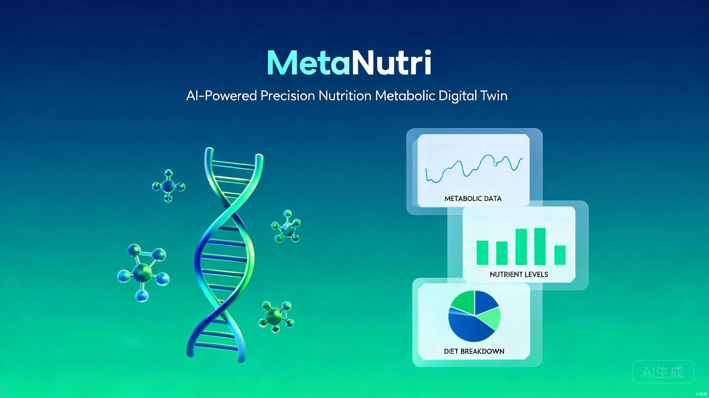

<div align="center">

<p align="right">
  <a href="README.md">English</a> | <strong>简体中文</strong>
</p>



# 🧬 MetaNutri

**AI 驱动的精准营养代谢数字孪生平台**

[](https://github.com/ElijahZhao/MetaNutri---AI-/stargazers)
[](https://github.com/ElijahZhao/MetaNutri---AI-/network/members)
[](LICENSE)
[](https://github.com/ElijahZhao/MetaNutri---AI-/issues)

[](https://nextjs.org/)
[](https://fastapi.tiangolo.com/)
[](https://www.python.org/)
[](https://supabase.com/)
[](https://pytorch.org/)

**[🌐 在线演示](https://meta-nutri-ai.vercel.app/) · [📖 文档](docs/) · [🐛 提交 Bug](https://github.com/ElijahZhao/MetaNutri---AI-/issues) · [✨ 功能建议](https://github.com/ElijahZhao/MetaNutri---AI-/issues)**

[](https://meta-nutri-ai.vercel.app/)
[](https://metanutri-ai-production.up.railway.app/)
[](https://supabase.com/)

</div>

---

## 📑 目录

- [项目简介](#-项目简介)
- [✨ 核心功能](#-核心功能)
- [🏗️ 系统架构](#️-系统架构)
- [🛠️ 技术栈](#️-技术栈)
- [🚀 快速开始](#-快速开始)
- [☁️ 云端部署](#️-云端部署)
- [📁 项目结构](#-项目结构)
- [🤝 参与贡献](#-参与贡献)
- [📄 许可证](#-许可证)
- [📮 联系方式](#-联系方式)

---

## 🌟 项目简介

**MetaNutri** 是一个基于 AI 的精准营养代谢数字孪生平台，通过整合**基因组学**、**微生物组学**和**代谢组学**数据，为用户提供个性化的营养建议和健康管理方案。

通过利用先进的深度学习架构（**Transformer**、**GNN**、**VAE**）以及 SHAP/LIME 可解释性技术，MetaNutri 搭建了多组学研究与实用饮食指导之间的桥梁。

### 🎯 为什么选择 MetaNutri？

| 痛点 | 解决方案 |
|------|---------|
| 🍎 通用饮食建议忽视个体生物差异 | 基于**你的**组学特征提供个性化推荐 |
| 🧬 基因组数据晦涩难懂 | AI 将复杂数据转化为可执行的洞察 |
| 📊 健康数据分散在不同 App | 统一面板整合基因组、微生物组、代谢组 |
| 🤖 AI 推荐像"黑盒"一样难以理解 | SHAP/LIME 可解释性展示**为什么**给出这个建议 |
| ⚠️ 被动式医疗模式 | 早期营养缺乏检测与健康风险预警 |

---

## ✨ 核心功能

<div align="center">

| | 功能 | 描述 |
|---|------|------|
| 🧬 | **三重组学整合** | 基因组 + 微生物组 + 代谢组数据统一分析流程 |
| 🤖 | **深度学习模型** | Transformer、GNN 和 VAE 架构用于代谢响应预测 |
| 🔍 | **可解释 AI** | 每条建议都附带 SHAP 和 LIME 特征重要性分析 |
| 🚨 | **健康预警** | 实时营养缺乏检测与健康风险评估 |
| 📊 | **交互式可视化** | 代谢路径图、ECharts 仪表盘、雷达图 |
| 👤 | **用户档案** | 个人健康指标、目标管理以及 RBAC 权限系统 |
| 🍽️ | **膳食计划** | 基于个体生理特征的 AI 个性化膳食方案 |
| 🌐 | **国际化支持** | 完整的英/中双语界面 |
| 📱 | **响应式设计** | 桌面、平板、移动端完美适配 |

</div>

---

## 🏗️ 系统架构

```
┌─────────────────────────────────────────────────────────────────────┐
│                              用户                                      │
│                         (浏览器 / 移动端)                              │
└──────────────────────────────────┬──────────────────────────────────┘
                                   │
                                   ▼
┌─────────────────────────────────────────────────────────────────────┐
│                          Vercel（前端部署）                            │
│  ┌──────────┐ ┌──────────┐ ┌──────────┐ ┌──────────┐              │
│  │ Next.js  │ │  React   │ │ ECharts  │ │ i18n     │              │
│  │  (SSR)   │ │  (UI)    │ │ (图表)   │ │ (本地化) │              │
│  └──────────┘ └──────────┘ └──────────┘ └──────────┘              │
└──────────────────────────────────┬──────────────────────────────────┘
                                   │  HTTPS / REST API
                                   ▼
┌─────────────────────────────────────────────────────────────────────┐
│                         Railway（后端部署）                             │
│  ┌─────────────────────────────────────────────────────────────┐    │
│  │                       FastAPI (Python)                        │    │
│  │  ┌─────────┐ ┌─────────┐ ┌─────────┐ ┌─────────┐          │    │
│  │  │  认证   │ │  用户   │ │  饮食   │ │  组学   │          │    │
│  │  └─────────┘ └─────────┘ └─────────┘ └─────────┘          │    │
│  │  ┌─────────┐ ┌─────────┐ ┌─────────┐ ┌─────────┐          │    │
│  │  │  预测   │ │  预警   │ │  数据集  │ │  导入   │          │    │
│  │  └─────────┘ └─────────┘ └─────────┘ └─────────┘          │    │
│  └─────────────────────────────────────────────────────────────┘    │
│  ┌──────────────┐  ┌──────────────┐  ┌──────────────┐             │
│  │  PyTorch     │  │  SQLAlchemy  │  │  Redis (可选)│             │
│  │  (机器学习模型) │  │   (ORM)     │  │   (缓存)     │             │
│  └──────────────┘  └──────────────┘  └──────────────┘             │
└──────────────────────────────────┬──────────────────────────────────┘
                                   │
                                   ▼
┌─────────────────────────────────────────────────────────────────────┐
│                       Supabase（数据库服务）                           │
│  ┌──────────────────┐  ┌──────────────────┐  ┌──────────────────┐  │
│  │  PostgreSQL      │  │  身份认证         │  │  对象存储        │  │
│  │  (用户 + 组学数据)│  │  (JWT + OAuth)   │  │  (数据集存储)    │  │
│  └──────────────────┘  └──────────────────┘  └──────────────────┘  │
└─────────────────────────────────────────────────────────────────────┘
```

---

## 🛠️ 技术栈

### 🎨 前端

| 技术 | 版本 | 用途 |
|------|------|------|
| [Next.js](https://nextjs.org/) | 16 | React 框架，支持服务端渲染与 SEO |
| [React](https://react.dev/) | 19 | UI 组件库 |
| [TypeScript](https://www.typescriptlang.org/) | 5 | 类型安全 |
| [Tailwind CSS](https://tailwindcss.com/) | 3 | 原子化 CSS 框架 |
| [ECharts](https://echarts.apache.org/) | 5 | 数据可视化 |
| [TanStack Query](https://tanstack.com/query) | 5 | 服务端状态管理与缓存 |
| [Zustand](https://zustand-demo.pmnd.rs/) | 5 | 客户端状态管理 |
| [React Hook Form](https://react-hook-form.com/) | 7 | 表单验证 |
| [Zod](https://zod.dev/) | 4 | Schema 验证 |
| [i18next](https://www.i18next.com/) | - | 国际化 |

### ⚙️ 后端

| 技术 | 版本 | 用途 |
|------|------|------|
| [FastAPI](https://fastapi.tiangolo.com/) | 0.115 | 高性能异步 API 框架 |
| [Python](https://www.python.org/) | 3.11 | 运行时 |
| [SQLAlchemy](https://www.sqlalchemy.org/) | 2.0 | 异步 ORM |
| [PostgreSQL](https://www.postgresql.org/) | - | 主数据库 |
| [Redis](https://redis.io/) | 7 | 缓存（可选） |
| [Pydantic](https://docs.pydantic.dev/) | 2 | 数据验证 |
| [JWT](https://jwt.io/) | - | 身份认证 |
| [Passlib](https://passlib.readthedocs.io/) | - | 密码哈希 |

### 🧠 AI / 机器学习

| 技术 | 版本 | 用途 |
|------|------|------|
| [PyTorch](https://pytorch.org/) | 2.x | 深度学习框架 |
| [scikit-learn](https://scikit-learn.org/) | 1.5 | 传统机器学习 |
| [SHAP](https://shap.readthedocs.io/) | 0.46 | 模型可解释性 |
| [NumPy](https://numpy.org/) | 1.26 | 数值计算 |
| [Pandas](https://pandas.pydata.org/) | 2.2 | 数据处理 |
| [BioPython](https://biopython.org/) | 1.84 | 生物信息学 |

---

## 🚀 快速开始

### 前置条件

- **Python** ≥ 3.11
- **Node.js** ≥ 18
- **npm** ≥ 9 或 **pnpm** ≥ 8
- **PostgreSQL** ≥ 14（或使用 [Supabase](https://supabase.com/) 云端数据库）

### 📦 安装

```bash
# 1. 克隆仓库
git clone https://github.com/ElijahZhao/MetaNutri---AI-.git
cd MetaNutri---AI-

# 2. 配置后端
cd backend
cp .env.example .env          # 编辑填入你的配置
pip install -r requirements.txt
cd ..

# 3. 配置前端
cd frontend
cp .env.example .env.local     # 编辑填入你的 API 地址
npm install
cd ..

# 4. 启动服务（使用两个终端分别运行）
cd backend && uvicorn app.main:app --reload --host 0.0.0.0 --port 8000
cd frontend && npm run dev
```

### 🌐 访问地址

| 服务 | 地址 | 说明 |
|------|------|------|
| 前端应用 | http://localhost:3000 | Next.js 网页应用 |
| 后端 API | http://localhost:8000 | FastAPI 服务 |
| API 文档（Swagger） | http://localhost:8000/docs | 交互式 API 文档 |
| API 文档（ReDoc） | http://localhost:8000/redoc | 另一种 API 文档格式 |

### 🐳 Docker（可选方案）

```bash
# 一键启动所有服务
docker-compose up -d

# 查看日志
docker-compose logs -f

# 停止服务
docker-compose down
```

---

## ☁️ 云端部署

MetaNutri 采用以下技术栈实现无缝云端部署：

| 组件 | 平台 | 说明 |
|------|------|------|
| 🗄️ 数据库 | [Supabase](https://supabase.com/) | PostgreSQL + 认证一体化 |
| ⚙️ 后端 API | [Railway](https://railway.app/) | 一键 Python 部署 |
| 🎨 前端 Web | [Vercel](https://vercel.com/) | Next.js 原生平台 |

### 第一步：Supabase（数据库）

1. 在 [supabase.com](https://supabase.com/) 创建项目
2. 进入 **SQL Editor** → 新建查询
3. 执行 [`backend/schema.sql`](backend/schema.sql) 中的 SQL 语句
4. 从 **Settings → Database → Connection string (URI)** 复制连接字符串

### 第二步：Railway（后端）

1. 新建项目 → 从 GitHub 部署 → 选择你的仓库
2. **Settings → Build**：
   - Dockerfile Path: `backend/Dockerfile`
3. **Variables → 添加**：
   - `DATABASE_URL` = 你的 Supabase PostgreSQL 连接字符串
   - `SECRET_KEY` = 一个安全的随机字符串
4. **Settings → Networking → 开启 Outbound IPv6**（Supabase 需要）
5. 等待部署完成 → 复制你的 `.up.railway.app` 域名

### 第三步：Vercel（前端）

1. 从 GitHub 导入项目 → 选择你的仓库
2. **Root Directory**: `frontend`
3. **Framework Preset**: Next.js（自动识别）
4. **Environment Variables**:
   - `NEXT_PUBLIC_API_URL` = 你的 Railway 后端地址（例如 `https://xxx.up.railway.app`）
5. 点击 **Deploy**

---

## 📁 项目结构

```
MetaNutri---AI-/
├── backend/                          # ⚙️ FastAPI 后端
│   ├── app/
│   │   ├── api/                      # API 路由处理器
│   │   │   ├── auth.py               # 认证（注册/登录）
│   │   │   ├── users.py              # 用户档案管理
│   │   │   ├── food.py               # 饮食日志与营养
│   │   │   ├── genomic.py            # 基因组数据分析
│   │   │   ├── microbiome.py         # 微生物组分析
│   │   │   ├── metabolomics.py       # 代谢组数据
│   │   │   ├── predict.py            # AI 预测接口
│   │   │   ├── recommendation.py     # 营养建议
│   │   │   ├── datasets.py           # 数据集管理
│   │   │   ├── import_export.py      # 数据导入导出
│   │   │   └── nutrition_alerts.py   # 健康预警系统
│   │   ├── core/                     # 核心基础设施
│   │   │   ├── config.py             # 配置与环境变量
│   │   │   ├── security.py           # JWT 认证与密码哈希
│   │   │   └── redis.py              # Redis 缓存（优雅降级）
│   │   ├── db/                       # 数据库层
│   │   │   └── session.py            # SQLAlchemy 异步引擎
│   │   ├── ml/                       # 🧠 机器学习模型
│   │   │   ├── metabolic_response_model.py   # Transformer 预测器
│   │   │   ├── gene_nutrition_model.py       # GNN 基因-营养
│   │   │   ├── microbiome_vae.py             # VAE 微生物健康
│   │   │   ├── explainability.py              # SHAP/LIME 解释器
│   │   │   ├── microbiome_analysis.py         # 多样性分析
│   │   │   ├── dataset_downloader.py           # 公开数据集下载器
│   │   │   ├── train_models.py                 # 训练脚本
│   │   │   └── weights/                        # 预训练模型权重
│   │   ├── models/                   # SQLAlchemy ORM 模型
│   │   ├── schemas/                  # Pydantic 请求/响应 Schema
│   │   ├── services/                 # 业务逻辑层
│   │   └── main.py                   # FastAPI 应用入口
│   ├── data/                         # 种子与参考数据
│   ├── schema.sql                    # PostgreSQL 表定义
│   ├── requirements.txt              # Python 依赖
│   ├── Dockerfile                    # 生产容器
│   ├── railway.json                  # Railway 部署配置
│   └── .env.example                  # 环境变量模板
│
├── frontend/                         # 🎨 Next.js 前端
│   ├── src/
│   │   ├── app/                      # Next.js App Router 页面
│   │   │   ├── page.js               # 首页
│   │   │   ├── dashboard/            # 分析仪表盘
│   │   │   ├── login/                # 登录
│   │   │   ├── forgot-password/      # 找回密码
│   │   │   ├── profile/              # 用户档案
│   │   │   ├── genomic/              # 基因组分析
│   │   │   ├── microbiome/           # 微生物组分析
│   │   │   ├── metabolomics/         # 代谢组数据
│   │   │   ├── predict/              # AI 预测工具
│   │   │   ├── recommendations/      # 个性化建议
│   │   │   ├── meal-plan/            # AI 膳食计划
│   │   │   ├── explore/              # 食物探索
│   │   │   ├── datasets/             # 数据集浏览
│   │   │   ├── error.js              # 全局错误边界
│   │   │   ├── not-found.js          # 自定义 404 页面
│   │   │   └── layout.js             # 根布局（metadata、i18n）
│   │   ├── components/               # 可复用 UI 组件
│   │   │   ├── home/                 # 首页区块
│   │   │   ├── dashboard/            # 仪表盘小部件与卡片
│   │   │   ├── Navbar.js             # 导航栏
│   │   │   ├── ProtectedRoute.jsx    # 认证路由守卫
│   │   │   ├── ErrorBoundary.jsx     # React 错误边界
│   │   │   ├── Skeleton.js           # 加载骨架屏
│   │   │   ├── BioCanvas.jsx         # 动画 DNA 背景
│   │   │   ├── MetabolicPathway.jsx  # 交互式路径查看器
│   │   │   └── ...
│   │   └── lib/                      # 工具与服务
│   │       ├── api.js                # 带拦截器的 Axios 客户端
│   │       ├── i18n.js               # 国际化（英/中）
│   │       ├── hooks.js              # 自定义 React Hooks
│   │       └── store/
│   │           └── authStore.js      # Zustand 认证状态
│   ├── public/                       # 静态资源
│   ├── next.config.js                # Next.js 配置（安全响应头）
│   ├── tailwind.config.js            # Tailwind 主题
│   ├── vercel.json                   # Vercel 部署配置
│   ├── .eslintrc.json                # ESLint 规则
│   ├── .prettierrc                   # Prettier 格式化
│   ├── package.json                  # 依赖
│   └── Dockerfile                    # 生产容器
│
├── docs/                             # 📚 文档与资源
│   ├── assets/                       # 图片与图表
│   ├── API.md                        # API 参考
│   ├── DEPLOYMENT.md                 # 部署指南
│   ├── MODELS.md                     # AI 模型文档
│   └── DATASETS.md                   # 数据集参考
│
├── .github/                          # GitHub 配置
│   ├── ISSUE_TEMPLATE/               # Bug 与功能建议模板
│   └── PULL_REQUEST_TEMPLATE/        # PR 模板
│
├── docker-compose.yml                # 本地编排
├── start.sh                          # 一键启动脚本
├── CONTRIBUTING.md                   # 贡献指南
├── CODE_OF_CONDUCT.md                # 社区行为准则
├── LICENSE                           # MIT 许可证
├── README.md                         # 英文版（默认展示）
└── README.zh-CN.md                   # 👈 中文版
```

---

## 🤝 参与贡献

贡献是开源社区最宝贵的财富，也是学习、启发、创造的最佳途径。你所做的任何贡献我们都**万分感激**。

1. Fork 本项目
2. 创建你的功能分支（`git checkout -b feature/AmazingFeature`）
3. 提交你的改动（`git commit -m 'feat: add some AmazingFeature'`）
4. 推送到分支（`git push origin feature/AmazingFeature`）
5. 开启一个 Pull Request

请阅读 [CONTRIBUTING.md](CONTRIBUTING.md) 了解我们的行为准则和提交 PR 的详细流程。

---

## 📄 许可证

基于 MIT 许可证开源。更多信息请参阅 [LICENSE](LICENSE)。

---

## 📮 联系方式

**ElijahZhao** - [@ElijahZhao](https://github.com/ElijahZhao) - elijahzhao@gmail.com

项目链接：[https://github.com/ElijahZhao/MetaNutri---AI-](https://github.com/ElijahZhao/MetaNutri---AI-)

---

<div align="center">

由 **ElijahZhao** 用 ❤️ 打造

**MetaNutri** — AI 驱动的精准营养代谢数字孪生

[⬆ 返回顶部](#-metanutri)

</div>
