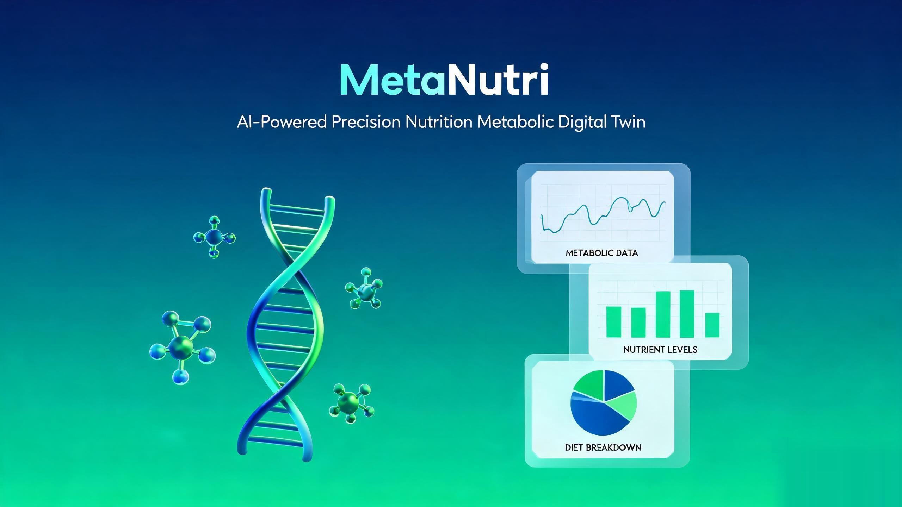

<div align="center">

<p align="right">
  <a href="README.md">English</a> | <strong>简体中文</strong>
</p>



# 🧬 MetaNutri

**AI 驱动的精准营养代谢数字孪生平台**

[](https://github.com/ElijahZhao/MetaNutri---AI-/stargazers)
[](https://github.com/ElijahZhao/MetaNutri---AI-/network/members)
[](LICENSE)
[](https://github.com/ElijahZhao/MetaNutri---AI-/actions/workflows/ci.yml)
[](https://github.com/ElijahZhao/MetaNutri---AI-/issues)
[](CONTRIBUTING.md)

[](https://nextjs.org/)
[](https://fastapi.tiangolo.com/)
[](https://www.python.org/)
[](https://supabase.com/)
[](https://pytorch.org/)

**[🌐 在线演示](https://meta-nutri-ai.vercel.app/) · [📖 文档](docs/) · [🐛 提交 Bug](https://github.com/ElijahZhao/MetaNutri---AI-/issues) · [✨ 功能建议](https://github.com/ElijahZhao/MetaNutri---AI-/issues)**

[](https://meta-nutri-ai.vercel.app/)
[](https://metanutri-backend.onrender.com/)
[](https://supabase.com/)

</div>

---

## 📑 目录

- [项目简介](#-项目简介)
- [✨ 核心功能](#-核心功能)
- [🏗️ 系统架构](#️-系统架构)
- [🛠️ 技术栈](#️-技术栈)
- [🚀 快速开始](#-快速开始)
- [🔌 API 与 AI/ML 实战](#-api-与-aiml-实战)
- [🧪 测试与 CI](#-测试与-ci)
- [☁️ 云端部署](#️-云端部署)
- [📁 项目结构](#-项目结构)
- [🤝 参与贡献](#-参与贡献)
- [📄 许可证](#-许可证)
- [📮 联系方式](#-联系方式)

---

## 🌟 项目简介

**MetaNutri** 是一个基于 AI 的精准营养代谢数字孪生平台，通过整合**基因组学**、**微生物组学**和**代谢组学**数据，为用户提供个性化的营养建议和健康管理方案。

通过利用先进的深度学习架构（**Transformer**、**GNN**、**VAE**）以及 SHAP/LIME 可解释性技术，MetaNutri 搭建了多组学研究与实用饮食指导之间的桥梁。

### 🎯 为什么选择 MetaNutri？

| 痛点 | 解决方案 |
|------|---------|
| 🍎 通用饮食建议忽视个体生物差异 | 基于**你的**组学特征提供个性化推荐 |
| 🧬 基因组数据晦涩难懂 | AI 将复杂数据转化为可执行的洞察 |
| 📊 健康数据分散在不同 App | 统一面板整合基因组、微生物组、代谢组 |
| 🤖 AI 推荐像"黑盒"一样难以理解 | SHAP/LIME 可解释性展示**为什么**给出这个建议 |
| ⚠️ 被动式医疗模式 | 早期营养缺乏检测与健康风险预警 |

---

## ✨ 核心功能

<div align="center">

| | 功能 | 描述 |
|---|------|------|
| 🧬 | **三重组学整合** | 基因组 + 微生物组 + 代谢组数据统一分析流程 |
| 🤖 | **深度学习模型** | 代谢响应、基因-营养（GNN）与微生物组（VAE）的 PyTorch 模型代码——研究代码；线上 API 目前采用确定性启发式 |
| 🔍 | **可解释 AI** | 每条建议都附带 SHAP 和 LIME 特征重要性分析 |
| 📊 | **交互式仪表盘** | 健康评分、身体指标与风险雷达卡片，由 ECharts 图表支撑 |
| 🚨 | **健康预警** | 实时营养缺乏检测与健康风险评估 |
| 🍎 | **食物与营养探索** | 可检索的食物数据库，并提供个性化食物评分 |
| 🍽️ | **AI 膳食计划** | 基于个体生理特征的 AI 个性化膳食方案 |
| 📁 | **数据集浏览器** | 浏览平台内置的精选参考数据集 |
| 📥 | **导入 / 导出** | 导入你自己的组学与饮食数据，导出分析结果 |
| 🔐 | **默认安全** | httpOnly Cookie 会话、bcrypt 哈希与请求限流 |
| 🌐 | **双语界面** | 完整的英/中双语界面，基于轻量自研 i18n 层 |
| 📱 | **精致且响应式** | DNA / 粒子动画，桌面、平板、移动端完美适配 |

</div>

---

## 🏗️ 系统架构

```
┌─────────────────────────────────────────────────────────────────────┐
│                        用户（浏览器 / 移动端）                          │
└──────────────────────────────────┬──────────────────────────────────┘
                                   │  HTTPS
                                   ▼
┌─────────────────────────────────────────────────────────────────────┐
│                         Vercel（前端部署）                             │
│     Next.js 16 App Router — 静态预渲染页面                            │
│  ┌───────────────┐┌────────────────┐┌───────────────────────────┐   │
│  │  静态页面      ││  边缘中间件     ││  ECharts + 自研 i18n       │   │
│  │  (App Router) ││  (proxy.ts)    ││  (图表, 英 / 中)           │   │
│  └───────────────┘└────────────────┘└───────────────────────────┘   │
│    重写  /api/*  →  同源代理（Cookie 保持第一方，避免跨域）             │
└──────────────────────────────────┬──────────────────────────────────┘
                                   │  HTTPS / REST
                                   ▼
┌─────────────────────────────────────────────────────────────────────┐
│                         Render（后端部署）                             │
│                       FastAPI (Python 3.11)                         │
│  ┌────────┐┌────────┐┌────────┐┌────────┐┌──────────┐              │
│  │  认证  ││  用户  ││  饮食  ││  组学  ││  预测    │              │
│  └────────┘└────────┘└────────┘└────────┘└──────────┘              │
│  ┌────────┐┌──────────┐┌────────┐┌──────────────┐                  │
│  │  预警  ││  数据集   ││  导入  ││  ML (PyTorch)│                  │
│  └────────┘└──────────┘└────────┘└──────────────┘                  │
│   SQLAlchemy 2.0 异步 ORM · SHAP / LIME · 可选 Redis 缓存             │
└──────────────────────────────────┬──────────────────────────────────┘
                                   │
                                   ▼
┌─────────────────────────────────────────────────────────────────────┐
│                   Supabase（托管 PostgreSQL 数据库）                    │
│   存储用户、档案、饮食、组学与数据集表。                                │
│   认证由 FastAPI 通过 httpOnly Cookie 处理；                          │
│   未使用 Supabase Auth 与 Storage。                                   │
└─────────────────────────────────────────────────────────────────────┘
```

---

## 🛠️ 技术栈

### 🎨 前端

| 技术 | 版本 | 用途 |
|------|------|------|
| [Next.js](https://nextjs.org/) | 16 | React 框架，支持服务端渲染与 SEO |
| [React](https://react.dev/) | 19 | UI 组件库 |
| [TypeScript](https://www.typescriptlang.org/) | 5 | 类型安全 |
| [Tailwind CSS](https://tailwindcss.com/) | 3 | 原子化 CSS 框架 |
| [ECharts](https://echarts.apache.org/) | 6 | 数据可视化 |
| [TanStack Query](https://tanstack.com/query) | 5 | 服务端状态管理与缓存 |
| [Zustand](https://zustand-demo.pmnd.rs/) | 5 | 客户端状态管理 |
| [React Hook Form](https://react-hook-form.com/) | 7 | 表单验证 |
| [Zod](https://zod.dev/) | 4 | Schema 验证 |
| Custom i18n | - | 轻量英/中翻译（`src/lib/i18n.tsx`；不依赖 i18next） |

### ⚙️ 后端

| 技术 | 版本 | 用途 |
|------|------|------|
| [FastAPI](https://fastapi.tiangolo.com/) | 0.115 | 高性能异步 API 框架 |
| [Python](https://www.python.org/) | 3.11 | 运行时 |
| [SQLAlchemy](https://www.sqlalchemy.org/) | 2.0 | 异步 ORM |
| [PostgreSQL](https://www.postgresql.org/) | - | 主数据库 |
| [Redis](https://redis.io/) | 5 | 缓存与限流（可选，内存回退） |
| [Pydantic](https://docs.pydantic.dev/) | 2 | 数据验证 |
| [python-jose](https://github.com/mpdavis/python-jose) | 3.5 | JWT（签发进 httpOnly Cookie） |
| [Passlib](https://passlib.readthedocs.io/) | 1.7 | 密码哈希（bcrypt） |

### 🧠 AI / 机器学习

| 技术 | 版本 | 用途 |
|------|------|------|
| [PyTorch](https://pytorch.org/) | 2.x | 深度学习框架 |
| [scipy](https://scipy.org/) | 1.14 | 科学 / 统计计算 |
| [SHAP](https://shap.readthedocs.io/) | 0.46 | 模型可解释性 |
| [NumPy](https://numpy.org/) | 1.26 | 数值计算 |
| [Pandas](https://pandas.pydata.org/) | 2.2 | 数据处理 |
| [scikit-learn](https://scikit-learn.org/) | 1.5 | 特征缩放与基线模型（SHAP 可解释性） |
| [requests](https://docs.python-requests.org/) | 2.32 | HTTP 客户端（参考数据由本地生成，非下载） |

---

## 🚀 快速开始

### 前置条件

- **Python** ≥ 3.11
- **Node.js** ≥ 20.19
- **npm** ≥ 9 或 **pnpm** ≥ 8
- **PostgreSQL** ≥ 14（或使用 [Supabase](https://supabase.com/) 云端数据库）

### 📦 安装

```bash
# 1. 克隆仓库
git clone https://github.com/ElijahZhao/MetaNutri---AI-.git
cd MetaNutri---AI-

# 2. 配置后端
cd backend
cp .env.example .env          # 编辑填入你的配置
pip install -r requirements.txt
cd ..

# 3. 配置前端
cd frontend
cp .env.example .env.local     # 编辑填入你的 API 地址
npm install
cd ..

# 4. 启动服务（使用两个终端分别运行）
cd backend && uvicorn app.main:app --reload --host 0.0.0.0 --port 8000
cd frontend && npm run dev
```

### 🌐 访问地址

| 服务 | 地址 | 说明 |
|------|------|------|
| 前端应用 | http://localhost:3000 | Next.js 网页应用 |
| 后端 API | http://localhost:8000 | FastAPI 服务 |
| API 文档（Swagger） | http://localhost:8000/docs | 交互式 API 文档 |
| API 文档（ReDoc） | http://localhost:8000/redoc | 另一种 API 文档格式 |

### 🐳 Docker（可选方案）

```bash
# 一键启动所有服务
docker-compose up -d

# 查看日志
docker-compose logs -f

# 停止服务
docker-compose down
```

---

## 🔌 API 与 AI/ML 实战

完整的接口清单见 [📘 API 参考](docs/API.md)。后端交互式文档在 `<BASE>/docs`（Swagger）与 `<BASE>/redoc`。

### 认证（httpOnly Cookie）

登录后令牌通过 httpOnly Cookie 下发，前端无需手动附加 `Authorization` 头：

```http
POST /api/auth/login          # {username, password}
Set-Cookie: metanutri_access=...; HttpOnly; SameSite=Lax
Set-Cookie: metanutri_refresh=...; HttpOnly; SameSite=Lax
```

### 一条完整的 AI 调用链路

1. **登录** 获取会话 → 之后请求自动带 Cookie。
2. **上传组学数据**：`POST /api/genomic/upload`、`/api/microbiome/upload`、`/api/metabolomics/upload`。
3. **跑预测**：`POST /api/predict/glucose-response` 或 `GET /api/predict/risk-assessment`。
4. **拿推荐/饮食计划**：`POST /api/recommendations/meal-plan`。
5. **获取可解释性**：预测返回里含营养解读与 `feature_contributions`（SHAP）。

```bash
BASE=https://metanutri-backend.onrender.com

# 登录并保存 Cookie
curl -c cookies.txt -X POST "$BASE/api/auth/login" \
  -H 'Content-Type: application/json' \
  -d '{"username":"you","password":"secret123"}'

# 生成饮食计划（需登录）
curl -b cookies.txt -X POST "$BASE/api/recommendations/meal-plan" \
  -H 'Content-Type: application/json' \
  -d '{"calorie_target":2000}'
```

### AI/ML 模块（后端）

| 模块 | 能力 |
|------|------|
| `ml/metabolic_response_model.py` | 血糖响应 / 营养吸收预测器 |
| `ml/gene_nutrition_model.py` | 基因-营养关联（GNN） |
| `ml/microbiome_vae.py` | 微生物组健康（VAE） |
| `ml/explainability.py` | SHAP + 自定义 LIME 可解释性 |
| `ml/train_models.py` | 模型训练脚本 |
| `ml/weights/` | 预训练权重 |

---

## 🧪 测试与 CI

| 检查项 | 工具 | 命令 |
|--------|------|------|
| 类型安全 | TypeScript（`tsc --noEmit`） | `npm run typecheck` |
| 代码规范 | ESLint（扁平配置） | `npm run lint` |
| 单元 / 组件测试 | Vitest + Testing Library | `npm test` |
| 端到端测试 | Playwright（Chromium） | `npm run test:e2e` |
| 后端语法 + 导入冒烟测试 | `compileall` + FastAPI 导入 | `python -m compileall -q app` |

每次 push 与 Pull Request 都会通过 [`.github/workflows/ci.yml`](.github/workflows/ci.yml) 运行以上全部检查。

---

## ☁️ 云端部署

MetaNutri 采用以下技术栈实现无缝云端部署：

| 组件 | 平台 | 说明 |
|------|------|------|
| 🗄️ 数据库 | [Supabase](https://supabase.com/) | 托管 PostgreSQL |
| ⚙️ 后端 API | [Render](https://render.com/) | 从 GitHub 的 Python 部署 |
| 🎨 前端 Web | [Vercel](https://vercel.com/) | Next.js 原生平台 |

### 第一步：Supabase（数据库）

1. 在 [supabase.com](https://supabase.com/) 创建项目
2. 进入 **SQL Editor** → 新建查询
3. 执行 [`backend/schema.sql`](backend/schema.sql) 中的 SQL 语句
4. 从 **Settings → Database → Connection string (URI)** 复制连接字符串

### 第二步：Render（后端）

1. 在 [render.com](https://render.com/) 新建 **Web Service** → **Build & Deploy from a Repository** → 选择你的仓库
2. 在 **Settings → Docker** 中，将 **Dockerfile 路径** 设为 `backend/Dockerfile`
3. 在 **Environment** 中添加：
   - `DATABASE_URL` = 你的 Supabase **连接池** 地址（使用端口 **5432 会话模式**——Render 不支持 IPv6，因此请使用 `*.pooler.supabase.com`，不要用仅 IPv6 的直连地址）
   - `SECRET_KEY` = 一个安全的随机字符串
4. 等待部署完成 → 复制你的 `https://your-service.onrender.com` 域名

### 第三步：Vercel（前端）

1. 从 GitHub 导入项目 → 选择你的仓库
2. **Root Directory**: `frontend`
3. **Framework Preset**: Next.js（自动识别）
4. **Environment Variables**:
   - `NEXT_PUBLIC_API_URL` = 你的 Render 后端地址（例如 `https://your-service.onrender.com`）
5. 点击 **Deploy**

---

## 📁 项目结构

```
MetaNutri---AI-/
├── backend/                          # ⚙️ FastAPI 后端
│   ├── app/
│   │   ├── api/                      # API 路由处理器
│   │   │   ├── auth.py               # 认证（注册 / 登录 / 刷新）
│   │   │   ├── users.py              # 用户档案管理
│   │   │   ├── food.py               # 食物检索、饮食日志与营养
│   │   │   ├── genomic.py            # 基因组数据分析
│   │   │   ├── microbiome.py         # 微生物组分析
│   │   │   ├── metabolomics.py       # 代谢组数据
│   │   │   ├── predict.py            # AI 预测接口
│   │   │   ├── recommendation.py     # 营养建议与膳食计划
│   │   │   ├── datasets.py           # 数据集管理
│   │   │   ├── import_export.py      # 数据导入导出
│   │   │   └── nutrition_alerts.py   # 健康预警系统
│   │   ├── core/                     # 核心基础设施
│   │   │   ├── config.py             # 配置与环境变量
│   │   │   ├── security.py           # JWT + httpOnly Cookie 认证、密码哈希
│   │   │   ├── rate_limit.py         # 内存限流
│   │   │   └── redis.py              # Redis 缓存（优雅降级）
│   │   ├── db/
│   │   │   └── session.py            # SQLAlchemy 异步引擎
│   │   ├── ml/                       # 🧠 机器学习模型
│   │   │   ├── metabolic_response_model.py   # Transformer 预测器
│   │   │   ├── gene_nutrition_model.py       # GNN 基因-营养
│   │   │   ├── microbiome_vae.py             # VAE 微生物健康
│   │   │   ├── explainability.py             # SHAP / LIME 解释器
│   │   │   ├── dataset_downloader.py         # 参考数据集获取器
│   │   │   ├── train_models.py               # 训练脚本
│   │   │   └── weights/                      # 预训练模型权重
│   │   ├── models/                   # SQLAlchemy ORM 模型
│   │   ├── schemas/                  # Pydantic 请求 / 响应 Schema
│   │   ├── services/                 # 业务逻辑（种子数据、导入 / 导出）
│   │   └── main.py                   # FastAPI 应用入口
│   ├── data/                         # 种子与参考数据集（JSON）
│   ├── schema.sql                    # PostgreSQL 表定义
│   ├── requirements.txt              # Python 依赖
│   ├── Dockerfile                    # 生产容器
│   └── .env.example                  # 环境变量模板
│
├── frontend/                         # 🎨 Next.js 前端
│   ├── src/
│   │   ├── app/                      # Next.js App Router
│   │   │   ├── (auth)/               # 公开认证组
│   │   │   │   ├── login/            # 登录
│   │   │   │   └── forgot-password/  # 密码找回
│   │   │   ├── (app)/                # 受保护应用组（需鉴权）
│   │   │   │   ├── dashboard/        # 分析仪表盘与健康评分
│   │   │   │   ├── profile/          # 用户档案
│   │   │   │   ├── genomic/          # 基因组分析
│   │   │   │   ├── microbiome/       # 微生物组分析
│   │   │   │   ├── metabolomics/     # 代谢组数据
│   │   │   │   ├── predict/          # AI 预测工具
│   │   │   │   ├── recommendations/  # 个性化建议
│   │   │   │   ├── meal-plan/        # AI 膳食计划
│   │   │   │   ├── explore/          # 食物探索
│   │   │   │   └── datasets/         # 数据集浏览
│   │   │   ├── page.tsx              # 首页
│   │   │   ├── content.tsx           # 首页内容
│   │   │   ├── layout.tsx            # 根布局（metadata、i18n）
│   │   │   ├── loading.tsx           # 路由加载 UI
│   │   │   ├── error.tsx             # 全局错误边界
│   │   │   ├── not-found.tsx         # 自定义 404 页面
│   │   │   ├── icon.svg              # 网站图标
│   │   │   ├── opengraph-image.tsx   # 动态 Open Graph 图
│   │   │   ├── twitter-image.tsx     # 动态 Twitter 卡片
│   │   │   ├── robots.ts             # robots.txt
│   │   │   └── sitemap.ts            # sitemap.xml
│   │   ├── components/               # 可复用 UI 组件
│   │   │   ├── home/                 # 首页区块（Hero、功能、CTA）
│   │   │   ├── dashboard/            # 仪表盘小部件与卡片
│   │   │   ├── Navbar.tsx            # 导航栏
│   │   │   ├── ProtectedRoute.tsx    # 认证路由守卫
│   │   │   ├── ErrorBoundary.tsx     # React 错误边界
│   │   │   ├── Skeleton.tsx          # 加载骨架屏
│   │   │   ├── MetabolicPathway.tsx  # 交互式路径查看器
│   │   │   ├── NutritionAlerts.tsx   # 健康预警提示
│   │   │   ├── BioCanvas.tsx         # 动画 DNA 背景
│   │   │   ├── BioBackground.tsx     # 生物主题页面背景
│   │   │   ├── ParticleBackground.tsx# 粒子场动画
│   │   │   ├── ScrollReveal.tsx      # 滚动触发动效
│   │   │   ├── SpotlightTitle.tsx    # 首屏标题动效
│   │   │   └── TypeWriter.tsx        # 打字机文字效果
│   │   ├── constants/                # 共享常量（档案选项、BMI）
│   │   ├── lib/                      # 工具与服务
│   │   │   ├── api.ts                # Axios 客户端（同源、Cookie 认证）
│   │   │   ├── backendWarmup.ts      # 冷启动预热辅助
│   │   │   ├── hooks.ts              # 自定义 React Hooks
│   │   │   ├── i18n.tsx              # 国际化（英 / 中）
│   │   │   └── store/authStore.ts    # Zustand 认证状态
│   │   ├── types/                    # 共享 TypeScript 类型
│   │   └── proxy.ts                  # Next.js 边缘鉴权守卫
│   ├── tests/e2e/                    # Playwright 端到端测试
│   ├── scripts/start-standalone.mjs  # 独立服务启动脚本
│   ├── public/                       # 静态资源
│   ├── next.config.ts                # Next.js 配置（同源 /api 重写）
│   ├── tailwind.config.js            # Tailwind 主题
│   ├── vercel.json                   # Vercel 部署配置
│   ├── eslint.config.mjs             # ESLint 扁平配置
│   ├── vitest.config.mjs             # Vitest 配置
│   ├── playwright.config.ts          # 端到端测试配置
│   ├── Dockerfile / Dockerfile.dev   # 生产 / 开发容器
│   └── package.json                  # 依赖与脚本
│
├── docs/                             # 📚 文档与资源
│   ├── assets/                       # Banner 与截图
│   ├── API.md                        # API 参考
│   ├── DEPLOYMENT.md                 # 部署指南
│   ├── DATASETS.md                   # 数据集参考
│   └── AUDIT-FINDINGS.md             # 仓库审计记录
│
├── .github/                          # GitHub 配置
│   ├── workflows/                    # CI 与保活工作流
│   ├── ISSUE_TEMPLATE/               # Bug 与功能建议模板
│   └── PULL_REQUEST_TEMPLATE/        # PR 模板
│
├── docker-compose.yml                # 本地编排
├── start.sh                          # 一键启动脚本
├── CONTRIBUTING.md                   # 贡献指南
├── CODE_OF_CONDUCT.md                # 社区行为准则
├── LICENSE                           # MIT 许可证
├── README.md                         # 英文版（默认展示）
└── README.zh-CN.md                   # 👈 中文版
```

---

## 🤝 参与贡献

贡献是开源社区最宝贵的财富，也是学习、启发、创造的最佳途径。你所做的任何贡献我们都**万分感激**。

1. Fork 本项目
2. 创建你的功能分支（`git checkout -b feature/AmazingFeature`）
3. 提交你的改动（`git commit -m 'feat: add some AmazingFeature'`）
4. 推送到分支（`git push origin feature/AmazingFeature`）
5. 开启一个 Pull Request

请阅读 [CONTRIBUTING.md](CONTRIBUTING.md) 了解我们的行为准则和提交 PR 的详细流程。

---

## 📄 许可证

基于 MIT 许可证开源。更多信息请参阅 [LICENSE](LICENSE)。

---

## 📮 联系方式

**ElijahZhao** - [@ElijahZhao](https://github.com/ElijahZhao) - elijahzhao@gmail.com

项目链接：[https://github.com/ElijahZhao/MetaNutri---AI-](https://github.com/ElijahZhao/MetaNutri---AI-)

---

<div align="center">

由 **ElijahZhao** 用 ❤️ 打造

**MetaNutri** — AI 驱动的精准营养代谢数字孪生

[⬆ 返回顶部](#-metanutri)

</div>
